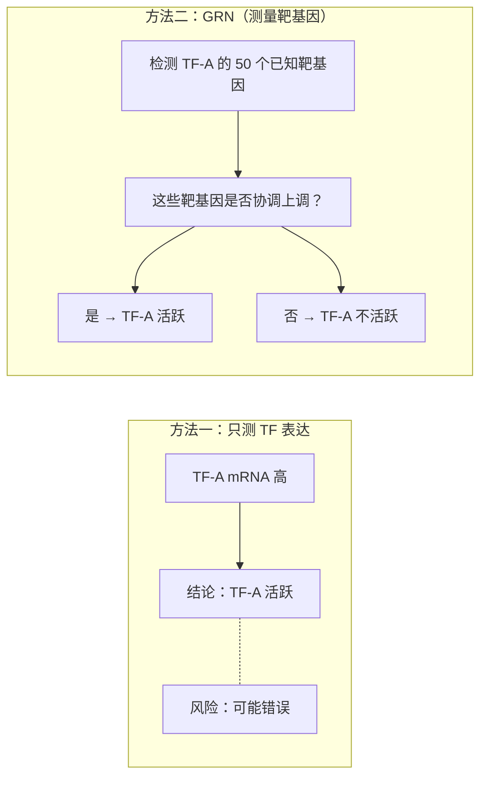

# GRN 基因调控网络

> 细胞类型的差异归根到底是由"谁在调谁的开关"决定的。基因调控网络（Gene Regulatory Network, GRN）试图画出这幅"开关地图"——哪些转录因子在控制哪些基因，以及这些转录因子本身在哪些细胞类型中真正"在工作"。

## 我们为什么要分析基因调控网络？

经过前面的步骤，你已经完成了：聚类（哪些细胞类型）、标记基因（它们的特点是什么）、差异表达（条件间有哪些变化）、富集分析（这些基因在干什么）。

但你还有一个更深层的问题没有回答：**这些差异的"根因"是什么？**

想象一下：你的视网膜数据中，感光细胞高表达了大量与视觉相关的基因。但这个问题的"根因"可能是一个或几个**转录因子（Transcription Factor, TF）**——比如 CRX 和 NRL——它们作为"主开关"打开了整条光转导通路。如果 CRX 没有被表达，感光细胞就不会产生视蛋白、不会形成外节、不会对光做出反应。

所以 GRN 试图回答的问题是：

1. 在每种细胞类型中，**哪些转录因子是活跃的（active）**——注意，是"活跃"而不是"表达"
2. 这些活跃的转录因子**调控哪些靶基因（target genes）**——从而驱动了该细胞类型的特异性功能
3. 不同细胞类型之间的**转录因子活性差异**是否可以解释它们为何不同

> 如果说富集分析回答的是"这些细胞在做什么"，GRN 回答的是"**谁在指挥这些事**"。

## TF 表达 vs TF 活性——最关键的区别

这是 GRN 分析中最容易被误解的概念。

**情况一：TF 的 mRNA 高表达，但 TF 是"不活跃"的**

想象一个转录因子叫"TF-A"。它的 mRNA 在某个细胞中大量存在（scRNA-seq 检测到很多条）。但是：

- TF-A 蛋白被翻译出来后，被锁在细胞质里，没有进入细胞核——于是它无法结合 DNA
- 或者 TF-A 蛋白被某个抑制子结合了，失去了转录激活能力  
- 或者 TF-A 蛋白需要被磷酸化（phosphorylation）才能激活——但磷酸激酶没有工作

所以：**mRNA 高 ≠ TF 在工作**。

由于 scRNA-seq 只测量 mRNA，不测量蛋白质，我们完全不知道 TF-A 的"蛋白状态"。

**情况二：TF 的 mRNA 不高，但它的靶基因全部高表达**

你可能会困惑。让我们换一个角度来解释：

> 转录因子在整个细胞中"做工作"的最后产出是**它的靶基因的表达**。要判断一个转录因子是否在一个细胞类型中"活跃"，应该看的是"**它调控的靶基因是否在一齐上调**"，而不是看"它自己的表达量是高还是低"。

举个例子：假设转录因子 PAX6 控制 100 个基因。在双极细胞中，PAX6 的 mRNA 水平是"中等"——但它的 100 个靶基因中，有 80 个都高表达。这就强烈暗示 PAX6 在双极细胞中是活跃的——它可能在翻译后水平被激活了，或者它只需要很低的 mRNA 水平就能维持其调控功能。

反之，如果 PAX6 的 mRNA 在 Müller 胶质细胞中非常高，但它的 100 个靶基因中只有 5 个高表达——PAX6 在 Müller 胶质细胞中可能就不活跃。

**这就是 GRN 分析的核心假设：通过一群靶基因的协同表达来推断上游 TF 的活性，而不是依赖 TF 本身的表达水平。**

### 为什么要用 CollecTRI 或 DoRothEA？

为了做这件事，你需要一个数据库告诉你"转录因子 X 控制哪些靶基因"。

- **CollecTRI：** 包含约 1,185 个转录因子及其靶基因，覆盖了人类和小鼠的调控关系。它是目前覆盖面最大的 TF→靶基因数据库之一。靶基因关系是**有向且有符号的**——会告诉你 TF 是**激活（+）** 还是**抑制（-）** 某个靶基因。Fuxi 默认使用 CollecTRI
- **DoRothEA：** 更小但"质控更严"的数据库。每个 TF→靶基因关系被赋予一个置信度评级（A 到 E，A 为最高）
  - A 级：来自多篇文献和多个实验方法验证的"金标准"关系
  - B 级：来自可靠实验方法验证
  - E 级：仅从表达相关性推断的"低质量"关系
  - Fuxi 默认只使用 A-C 级，过滤掉不可靠的 D-E 级

**为什么这两个数据库？** 因为构建 TF→靶基因关系需要大量的 ChIP-seq、RNA-seq 敲除、文献挖掘工作。自己从头做不可能——你必须依赖前人整理的资源。CollecTRI 和 DoRothEA 是 scRNA-seq 领域最常用的两个选择。

## 为什么在 pseudobulk 上做？

GRN 分析需要**基因表达的协方差（covariance）** 信息：要判断"五个基因是否一起上调"，你需要足够多的"数据点"来估算相关性。

在单细胞水平上，dropout 噪声（[第一章](01_中心法则与单细胞测序.md)）太严重了——一个基因在一个细胞中应该表达但被 dropout 丢失了概率可能是 30-50%。在这么高的噪声水平下估计协方差，结果基本是一堆噪音。

**Pseudobulk 的解决思路：** 把所有属于同一细胞类型的细胞求**平均表达量**。假设你有 1,000 个感光细胞，求完平均值后，dropout 的影响被平滑了。如果一个基因在 70% 的感光细胞中表达，它的 pseudobulk 表达值就是 0.7 × mean(表达量) 左右——而不是 0。

但 pseudobulk 也有代价：**你失去了细胞级别的信息。** 你不能在 GRN 中说"在感光细胞的某个亚群中，TF-B 的活性较高"。GRN 的受众是每个细胞类型作为一个整体。

## Fuxi 是怎么做的？

Fuxi 的 Step 11 使用 **decoupler-py** 库（一个专用的"生物活性推断"包）来运行 GRN 分析：

1. **聚合 pseudobulk：** 对每种细胞类型，计算该类型所有细胞在每个基因上的平均表达量
2. **加载 TF 数据库：** 根据配置选择 CollecTRI（默认）或 DoRothEA
3. **TF 活性推断：** 使用**多元线性模型**（multivariate linear model，简称 MLM）或**加权平均**（weighted mean, WMEAN）方法，对每种细胞类型评估每个 TF 的"活性分数"。简单来说就是——对于每个 TF，看它调控的靶基因在 pseudobulk 中的平均表达量，是否显著高于随机选择的同数量基因
4. **结果筛选：** 只保留活性分数在前 N 的 TF（默认显示 top 50 最可变的 TF）
5. **可视化：** 生成 TF 活性热图 + 层级聚类树
6. **输出 TF→靶基因边表：** 将 top-variance TF 的调控关系（每个 TF 调控哪些靶基因）导出为 `tf_target_edges.csv`，同时输出各 TF 的靶基因数量汇总 `tf_target_counts.csv`

> 具体参数配置见 [Pipeline 指南](../pipeline_guide_zh-CN.md#step-11-GRN-调控网络)

一个重要的内置决策：**CollecTRI/DoRothEA 中的靶基因关系来自"通用"（human/mouse）数据**。如果你的物种是斑马鱼、果蝇或其他模式生物，这些数据库的覆盖率会大幅降低，GRN 分析结果的质量取决于有多少已知的 TF→靶基因关系已在你研究的物种中得到验证。

### Run-time 说明

GRN 分析的运算量与细胞类型数量相关——每种细胞类型都要对 ~1,000 个 TF 计算活性分数。实际运行时间可能比前面的步骤更长（因为这是计算密集型的基因集活性评估）。结果文件是一张热图 + 一个活性分数表格。

## 我怎么看结果？

### TF 活性热图

这是 GRN 分析的核心输出。和富集分析气泡图类似，TF 热图是一张中高密度信息的图：

- **列：** 细胞类型（按层级聚类排列——相似的细胞类型在热图上会相邻）
- **行：** TF（只显示 top 50 个在细胞类型间变化最大的 TF）
- **颜色：** TF 活性分数（归一化后，红色 = 高活性，蓝色 = 低活性）
- **列/行树枝状结构（dendrogram）：** 层级聚类的分叉树——列树告诉你"哪些细胞类型的调控程序相似"，行树告诉你"哪些 TF 的调控模式类似"

**阅读方法（分四个层次）：**

1. **第一层—看列树分叉：** 细胞类型是如何分组的？比如，如果"感光细胞"和"双极细胞"被聚类在一起，说明它们在 TF 活性层面上最相似——因为它们是视网膜中两条主要的主干细胞类型，共享了"神经分化"的基本调控程序。而 Müller 胶质细胞可能被单独分支出去（因为它是胶质细胞，不是神经元）

2. **第二层—找"红块"：** 哪几种细胞类型有最深的红色区域（多个 TF 同时高活性）？这些是调控程序最活跃的细胞类型

3. **第三层—找细胞类型特异的 TF：** 在"感光细胞"列中，向上看：有没有某一行是**感光细胞红、其他细胞蓝**的 TF？那个 TF 可能是感光细胞特异的主调控因子（master regulator）。比如，如果 CRX 在感光细胞中是红色，在其他细胞中是蓝色——完全符合已知生物学（CRX 是感光细胞发育的主调控因子）

4. **第四层—找共享的 TF 模块：** 如果几个 TF 在整个热图中表现出同步的模式（它们在所有细胞类型中同时高或同时低）——它们可能在同一个调控回路（regulatory module）中工作

### TF 活性分数表

Fuxi 同时还输出一张数值表（CSV 格式），每行是一个 TF、每列是细胞类型、值是活性分数。

**适合做什么：** 如果你想知道某个具体的 TF（比如"PAX6"）在哪种细胞类型中活性最高，直接查表更精确，不需要从热图的颜色深浅中估计。当你要做统计分析（"TF-X 在条件 A 和条件 B 之间的活性有没有统计显著差异"）时，数值表是必须的。

### TF→靶基因调控边表

除了活性分数外，Fuxi 还会输出 `tf_target_edges.csv`——这是 CollecTRI 数据库中 top-variance TF 的**调控关系列表**：每一行记录一条"TF A 调控基因 B"的边。同时输出的 `tf_target_counts.csv` 汇总了每个 TF 调控的靶基因数量。

**适合做什么：** 当你发现某个 TF（如 CRX）在感光细胞中活性最高时，下一步自然想问——CRX 具体调控了哪些基因？打开 `tf_target_edges.csv` 过滤出 `source = CRX`，就能看到下游靶基因列表。这些靶基因中是否包含你之前看到的高表达标记基因？如果是，说明 CRX 确实在驱动感光细胞的基因表达程序。`tf_target_counts.csv` 则可用于快速评估 TF 的调控广度——有些 TF 是"广谱调控因子"（调控数百个基因），有些是"精准调控因子"（只调控少数几个特异性基因）。

## 常见误区

**"TF 表达高 = TF 活性高"**——如果你只从 GRN 分析中学到一件事，那就是上面这句的反转。**表达 ≠ 活性**。千万不要在论文中写"TF-A 在感光细胞中高表达，因此感光细胞受到 TF-A 的调控"——你应该说"根据 CollecTRI 数据库，TF-A 的靶基因在感光细胞中协同上调，表明 TF-A 在该类细胞中具有较高的预测活性"。二者的区别是靶基因协同性 vs 单基因表达量。

**"GRN 告诉我一个全新的调控机制"**——不，GRN 分析告诉你的是"根据已知的 TF→靶基因数据库，在你的数据中推断出哪些 TF 可能活跃"。如果某个 TF 的靶基因都在你的感光细胞中上调了，那只是在验证了 CollecTRI 中已经收录的知识。**GRN 不能发现未知的 TF→靶基因关系，它只评估已知关系的活性。** 发现新调控关系需要你自己的 ChIP-seq 或 knock-out 实验。

**"pseudobulk 在任何情况下都合适"**——不。Pseudobulk 要求"你在同一个 pseudobulk 组内的细胞是均匀的"。如果你的"感光细胞"实际上包含了杆状（rod）和锥状（cone）两种——它们的调控程序差异巨大，求平均会互相抵消信号。所以做 GRN 之前，你应该确认每个细胞类型确实是一个"在调控层面足够均匀"的群体——你可能需要先做 [subcluster 分析](10_Subcluster分析.md)把感光细胞再分细一些

**"GRN 是可以不用看 QC 就直接跑的步骤"**——不是。GRN 性能受数据质量影响很大。如果 pseudobulk 是基于质量很差的细胞构建的（例如在[Step 02 QC](06_质量控制.md)及以前的步骤没有严格遵守标准），结果完全是噪声。所以在运行 GRN 之前，一定要通过 [Step 10 的全局检查](14_探索性分析与输出汇总.md)——确保你用于聚合的每一类细胞都是高质量的

**"所有细胞类型都适合做 GRN"**——不。如果某一类只有 20 个细胞（极小类），pseudobulk 的统计稳定性会很低（这个平均值仅来自 20 个细胞，可能被两个异常值扭曲）。对极小数量的细胞类型来说，GRN 的结果**远不如**直接查看标记基因来得可靠。

## 小结

- GRN 基因调控网络回答"谁在指挥谁"——把转录因子和它们调控的靶基因映射到细胞类型上
- **关键认知：TF 表达 ≠ TF 活性。** GRN 通过靶基因协同表达推断活性，不依赖 TF 本身的 mRNA 水平
- **CollecTRI 和 DoRothEA** 是预搭建的 TF→靶基因数据库——没有这些数据库，GRN 分析无法进行
- **Pseudobulk（按细胞类型取平均表达）** 用于减少 dropout 噪声——但代价是失去单细胞分辨率
- 读 TF 活性热图的顺序：列树（细胞类型关系）→ 红色区域（活跃 TF）→ 细胞类型特异 TF → 共享 TF 模块
- GRN 是验证已知关系的工具，不是发现新关系的工具

## 自己检查

> - 一个转录因子的 mRNA 在 scRNA-seq 中高表达，但 CollecTRI 推断它的活性很低——这矛盾吗？什么生物学机制可能导致这种现象？
> - GRN 的输入不是单细胞表达矩阵，而是按细胞类型聚合的 pseudobulk。为什么必须这样做？代价是什么？
> - 你能在单细胞数据中发现一个 CollecTRI 数据库中不存在的全新转录因子-靶基因关系吗？为什么？

- 如果对 AI 注释系统中利用 GRN 等信息综合判断感兴趣，可以参考[附录 D：AI 注释系统详解](D_AI注释系统详解.md)
